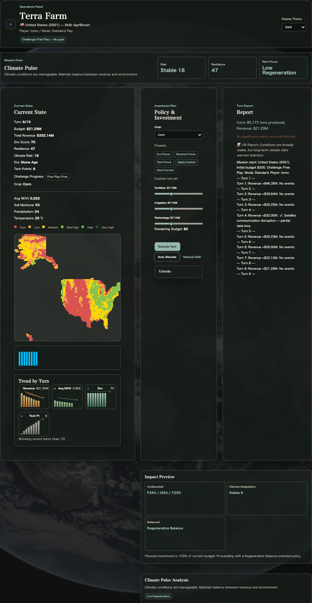

# Terra Farm

[](https://www.spaceappschallenge.org/)

Terra Farm is a strategic simulation game developed for the **NASA Space Apps Challenge** where you manage a nation's agricultural policy, balancing food production with environmental sustainability. Choose a country, invest a limited budget across crops, fertilizer, irrigation, and technology, and respond to changing conditions each turn as you aim for a high final score.

## Screenshots



## Key Features

- **Country Selection**: Choose from six countries (USA, China, India, Brazil, Egypt, Ireland), each with unique traits and starting conditions across five historical eras.
- **Strategic Investment**: Allocate your budget across crops, fertilizer, irrigation, and advanced technology using intuitive sliders.
- **Turn-Based Progression**: Make investment decisions, then execute a turn to see results simulated — crop yields, revenue, environmental impact, and more.
- **NDVI Map**: A satellite-data-inspired map visualizes vegetation health across your nation, updating each turn.
- **Dynamic Events**: Random events and UN reports occur each turn, forcing you to adapt your strategy.
- **Turn History & Logs**: Investment breakdowns, NDVI averages, environmental scores, and revenue are recorded each turn in a history panel and downloadable as JSON.
- **スコア**: 初期予算に対する残高・総収入の比率、環境スコア、技術時代から計算します。経済点は各比率15倍までを評価し、大きな初期予算だけでは有利になりません。
- **Challenge Modes**: Choose from Free Play, Eco Keeper (final environmental score ≥ 80), or Growth Drive (1.8× total revenue). Pass/fail is shown at game over.
- **Frontier Lab**: A dedicated mode set in hotter, drier conditions where you pursue the "Regeneration Loop" challenge (environment ≥ 78, initial NDVI +0.03, resilience ≥ 70).
- **Climate Pulse & Resilience**: Per-turn climate risk, regeneration power, and attention tags displayed as a mission pulse panel and recorded in history and logs.
- **Impact Preview**: Before executing a turn, preview your allocation mix, climate readiness, and policy signals derived from your slider positions.
- **Signal Theme**: A high-contrast, mission-control-inspired theme in addition to standard dark and light modes — highlights climate risk and critical indicators.
- **Trend Charts**: Bar + line charts show recent revenue, average NDVI, environmental score, and tech points at a glance.
- **One-Click Allocation Presets**: Apply "Eco Focus", "Profit Focus", or "Tech Focus" ratios instantly. Save your current slider values as a custom preset for later reuse.
- **Competition Mode**: Enter a player name and compete under fixed-seed tournament conditions. Rankings are stored locally in your browser.
- **i18n Support**: Japanese and English language support (switchable on the start screen).

## Tech Stack

- **Frontend**: Vanilla HTML / CSS / JavaScript (ES6) — no framework dependencies
- **Libraries**: Zero external runtime dependencies
- **Serving**: Uses `fetch` for local JSON map data, so `file://` direct open does not work. Default is `npm run dev`, which starts a small local static server.

## Setup

```bash
npm install          # First time only
npm run dev          # Starts a local static server
```

Open `http://127.0.0.1:8080/` in your browser. You can change the port with `PORT=8081 npm run dev`.

## 検証

Node.js 22 または 24 で次を実行します。GitHub Actions でも両バージョンで同じ検証を行います。

```bash
npm ci
npm run lint       # アプリ・テスト・スクリプトの構文チェック
npm test           # Node.js 標準の単体・回帰テスト
```

翻訳の通貨置換、固定シード乱数、実マップによる生産量・予算計算、全6か国の10ターン戦略、チャレンジ境界値、Canvas の色と透明度、開始予算補完、カスタム配分の保存を検証します。
ブラウザでの見た目・応答時間は単体テストの対象外です。

## 経済バランスと保存データ

- 推奨初期予算は農業政策予算の規模（USA $200M〜Ireland $15M）です。国を変更すると自動補完され、手動編集もできます。
- 生産量は国家規模（初期予算）に比例させ、国間・ターン間で収益比を比較できるようにしています。投資の正規化は「現在予算」基準で行い、予算規模や開始額に依らず同じ配分比が同じ効果になるようにしています（固定の下限は設けません）。
- 生産には肥料・灌漑・技術の投入バランスが必要です。肥料や灌漑を欠いた技術全振りでは収益が伸びず、環境目標（環境キーパー／再生ループ）は施肥を抑えた灌漑・技術投資で達成します。技術ポイントによる生産効率は3倍までとし、収益の無制限な膨張を防ぎます。
- 環境スコアは政策の持続可能性（施肥・水管理・技術）から目標値を算出し、毎ターンそこへ寄せます。肥料は減点、灌漑は加点、技術はわずかに加点です。
- スコアは `min(残高 / 初期予算, 15) × 1000 + min(総収入 / 初期予算, 15) × 1000 + 環境スコア × 100 + 技術時代 × 1000` です。
- 大会ルールは `2026-10-competition-v3` です。旧大会スコアは削除せず保存しますが、新大会のランキングには混ぜません。
- カスタム配分はブラウザの `localStorage` に保存し、リロード・次のミッションで復元します。保存が禁止されている環境では現在のセッション内だけで使えます。

## How to Play

1. Clone the repository and run `npm run dev` to start the local server.
2. Open `http://127.0.0.1:8080/` and choose your **player name**, **play mode**, **display theme**, and **language** on the start screen.
3. In Solo mode, freely configure your **country**, **starting budget**, **mission year**, and **challenge**. Frontier Lab locks the challenge to "Regeneration Loop". Competition mode uses fixed tournament conditions.
4. On the main screen, adjust sliders in the "Policy & Investment" panel. Use presets (Eco / Profit / Tech) or save and apply a custom preset to speed things up.
5. Before executing a turn, check the **Impact Preview** for your allocation mix, climate readiness, and policy signals.
6. Click **Execute Turn** to advance one turn. Results appear in the report, with mission pulse showing climate risk and resilience, and trend charts showing recent revenue, NDVI, environment, and tech points.
7. Scroll to **Turn History** below the report to review recent investment balance, NDVI, revenue, environmental score, and climate risk/resilience. Use **Download Log** to export detailed logs as JSON.
8. When the final turn ends, your total score and challenge result are displayed. In Competition mode, your score can be saved to the browser-local leaderboard.

## File Structure

```
/
├── index.html              # Main HTML file
├── css/
│   └── style.css           # Stylesheet
├── js/
│   ├── main.js             # Entry point and initialization
│   ├── config.js           # Game constants (crop data, event definitions)
│   ├── state.js            # Game state management (budget, score, settings)
│   ├── ui.js               # UI updates and event handling
│   ├── game-logic.js       # Core game logic (turn processing, scoring)
│   ├── map.js              # NDVI map rendering
│   ├── competition.js      # Competition mode, seeded RNG, local leaderboard
│   └── i18n.js             # Internationalization (Japanese / English)
├── data/
│   └── maps/               # Per-country, per-era NDVI map data (JSON)
└── images/
    ├── earth.jpg           # Background image
    ├── nasa_logo.png       # NASA logo for UI
    └── gameplay.png        # Gameplay screenshot
```

## Credits & Attribution

- **Unofficial Project Notice**: Terra Farm is an independent, unofficial project created for the NASA Space Apps Challenge. It is not endorsed, sponsored, or approved by NASA, and use of NASA-related references does not imply NASA affiliation or support.
- **NASA Space Apps Challenge**: This project was created as part of the [NASA Space Apps Challenge](https://www.spaceappschallenge.org/). The NASA logo and branding are used under the challenge guidelines for project presentation purposes.
- **Satellite Imagery**: Background image and map visualizations are inspired by NASA Earth observations. NDVI (Normalized Difference Vegetation Index) data concepts are derived from NASA MODIS (MOD13A3).
- **Icons & Assets**: Country flag emojis are standard Unicode emoji provided by the operating system.
- See [ATTRIBUTIONS.md](ATTRIBUTIONS.md) for source and asset attribution details.

## Security Disclaimer

### General

- このアプリはプレイヤー名、匿名ID、テーマ、言語、カスタム配分、ブラウザ内の大会スコアを `localStorage` に保存します。
- Competition mode is for demonstration and casual local play. Scores are computed and stored in the browser, so they should not be treated as tamper-proof.

## License

The source code in this repository is released under the MIT License.

NASA names, logos, insignia, imagery, and other third-party assets are not covered by the MIT License and remain subject to their respective owners' terms and guidelines.
